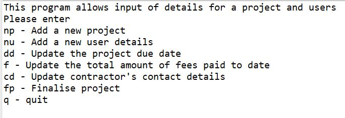
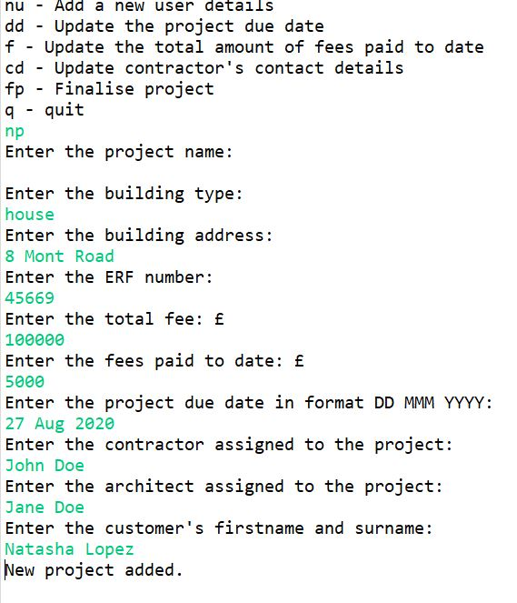
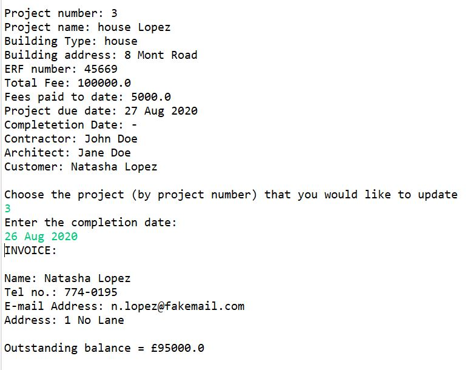

# Project Management System

## Description
This program is a project management system for a fictious civil engineering company. It is an initial submission for managing project to be completed by the company. 
The program uses Object Oriented Programming in Java where projects and the people associated with the project are objects. The user of the program can add new project, add new persons, update the details of the project and the users and generate invoices when the project is finalised.

This program can be adapted by any company carrying out projects to keep track of costs, completion of the project and people tagged to the project.

## Installation
1. The program is written in Java 14.0.2. If you don't have Java installed on your machine, it can be downloaded:

  https://www3.ntu.edu.sg/home/ehchua/programming/howto/JDK_HowTo.html#jdk-install

2. Recommend using Eclipse to run Java. It ca be downloaded here:

  https://www.eclipse.org/downloads/

3. Download the .java class files by clicking on the green CODE button in the repository and pressing download
4. Create a new project in Eclipse File > New > Java Project
5. In the src subfolder in this project, drag and drop project.java, person.java and ProjManagementSystem.java
6. Double click on the ProjManagementSystem file and click Run (and then Run) from the menu

## Usage
When the program is first run, the user is shown the main menu where they can choose one of the options as seen below. Once the option is chosen and completed, the program  
returns to this main menu. 

Sample of adding a new project. The project number is automatically generated and if a project name is not chosen, one is also generated.

Sample of invoice generated once a project is finalised.

